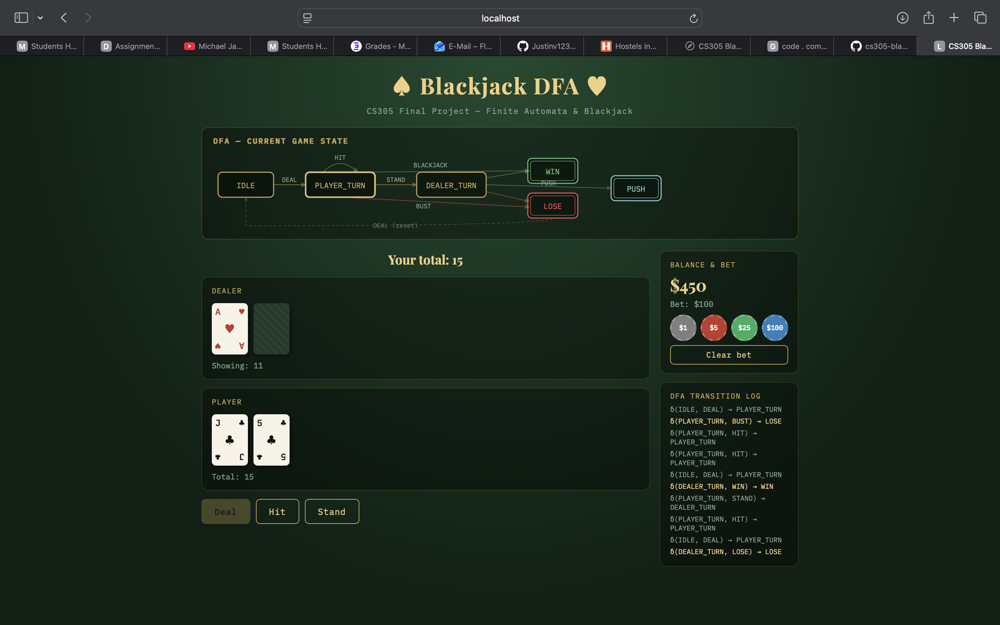

# CS305 Final Project — Blackjack DFA

## Project Title & Team

**Project Title:** Blackjack DFA

**Team Members:**
- Flavia Daniels, Student ID: s1365459
- Trevor Nolan, Student ID: s1355810

---

## Topic

**CS305 Topic:** Deterministic Finite Automata (DFA)

This project teaches the DFA topic by using a Blackjack game as an interactive visualization of automaton transitions. The game maps gameplay events like DEAL, HIT, STAND, BUST, and BLACKJACK to DFA input symbols. Every state change is visible in the live DFA diagram and transition log.

**Why this topic was chosen:**
- Finite automata are a foundational concept in CS305.
- Blackjack provides a familiar, engaging context for illustrating state transitions.
- The DFA model naturally fits the game’s step-by-step decision flow.

---

## Description

**What the project is:**
A browser-based Blackjack game where the game logic is implemented as a deterministic finite automaton. The app includes a visual state diagram, a transition log, and bet handling.

**How it works:**
- The DFA is defined as a 5-tuple `M = (Q, Σ, δ, q0, F)`.
- Game events are inputs from the alphabet Σ.
- The DFA transitions between states such as `IDLE`, `PLAYER_TURN`, `DEALER_TURN`, `WIN`, `LOSE`, and `PUSH`.
- When the player hits or stands, the machine moves along predefined transitions.
- The dealer plays automatically after the player stands, and the final outcome triggers the accepting state.

**How it teaches the topic:**
- The game makes DFA symbols concrete with actions like DEAL, HIT, and STAND.
- The state diagram updates live, showing the active automaton state.
- The transition log records each `δ(state, symbol) → nextState` computation in real time.
- Students can observe the DFA behavior while playing.

---

## How to Use

### Running the project

1. Clone the repo:
```bash
git clone https://github.com/danielsflavia/cs305-blackjack-dfa.git
cd cs305-blackjack-dfa
```
2. Open `index.html` directly in a browser, or run a local server:
```bash
python3 -m http.server 8080
```
3. Open `http://localhost:8080` in your browser.

### Playing the game
1. Click chip buttons to place a bet.
2. Click **Deal** to start a round.
3. Click **Hit** to draw another card.
4. Click **Stand** to finish your turn and let the dealer play.
5. Watch the DFA diagram and transition log update with each move.

---

## Screenshots



*Game start: initial `IDLE` state and empty bet.*


*Player turn: `PLAYER_TURN` after clicking Deal.*


*End state: final result shown as `WIN`, `LOSE`, or `PUSH`.*

> Place your screenshot files in `docs/screenshots/` using the names above before exporting to PDF.

---

## What You Learned

Building this project taught us:
- How to model interactive game flow as a deterministic finite automaton.
- How DFA states and transitions can represent real-world decision logic.
- How to keep UI and game logic separate using a modular web app structure.
- How to handle blackjack-specific rules like natural blackjack, soft 17, and push outcomes.

**Challenges:**
- Ensuring the DFA model matched the game flow exactly.
- Keeping the user interface synchronized with state changes.
- Making the app both playable and educational at the same time.

---

## GitHub Link

https://github.com/danielsflavia/cs305-blackjack-dfa
